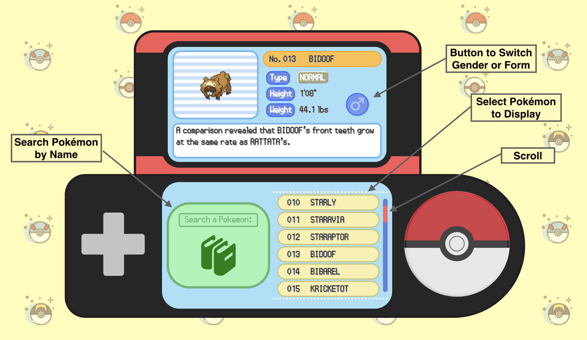

# Encyclodex (Encyclopedia + Pokédex)
[Encyclodex](https://brandon-a-ng.github.io/Encyclodex/)
## Concept
Encyclodex is a fun interactive website that explores the magical creatures of Pokémon. Individuals can learn about the unique and amazing traits of each Pokemon and discover the different forms some Pokemon can take!

## UI
Encyclodex is an easy to use interface replicating the Pokédex of the Generation 4 (Pokémon Diamond, Pearl, and Platnium) video games.

## Future Plans
• Functional D-pad feature that can scroll up and down the list

• Rotating Pokéball display when scolling through list

• Additional detail of each Pokémon (Abilities, Species, Footprint, or Cry)

• Shiny forms of each Pokémon

• Additional Pokémon entries for more Pokémon (Generation 1, 2, or 3 Pokémon)
